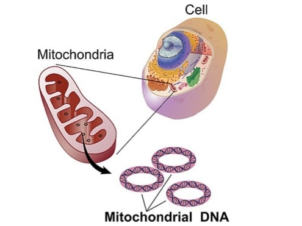
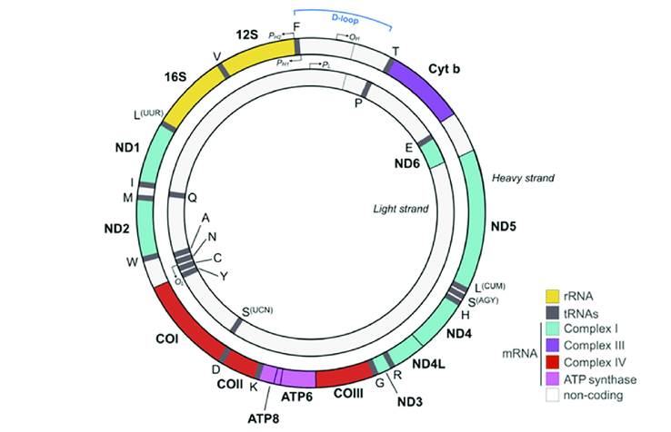
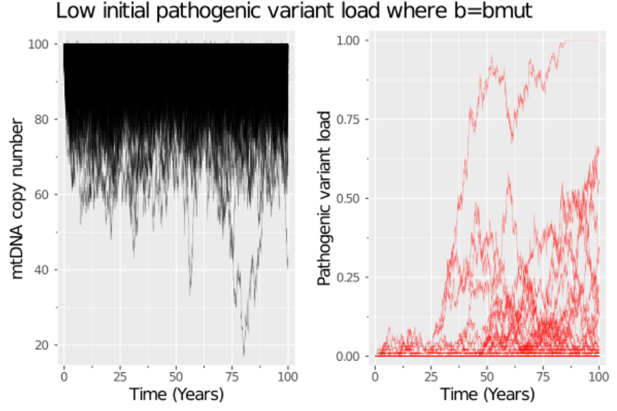
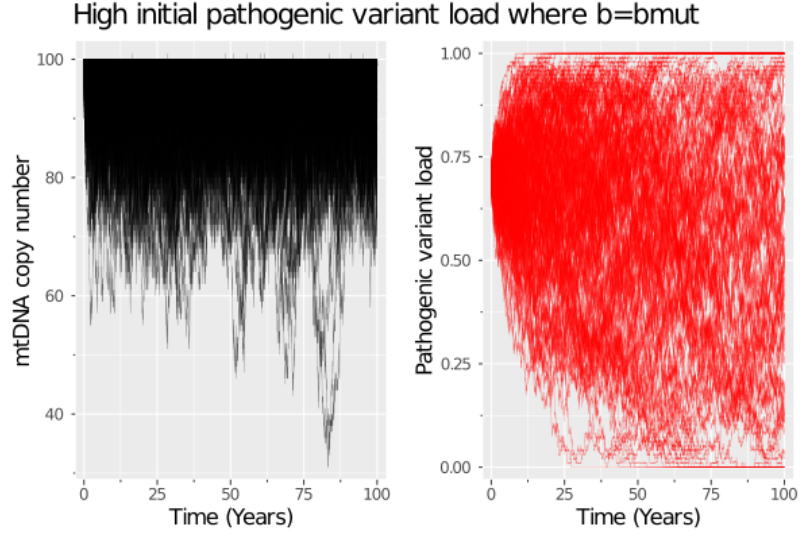
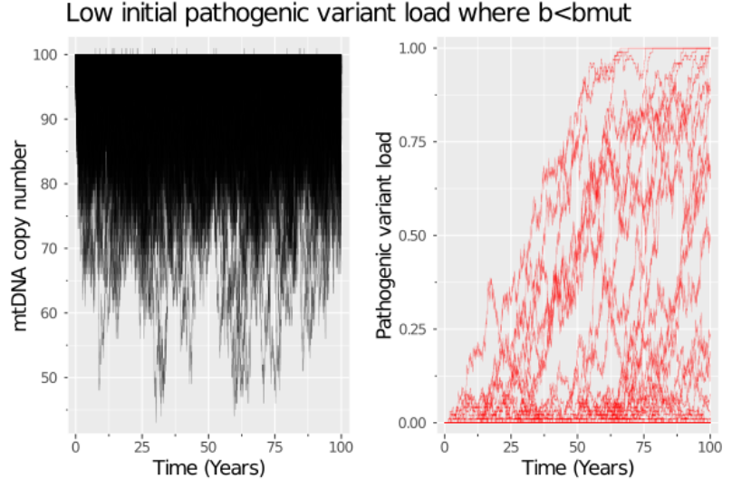

# **Nuffield Future Researchers Summer Project**

# **Mathematical modelling of single cell mtDNA population dynamics**

# Patrick MacPherson

#### Sgoil Lionacleit

#### Project supervisors:

#### Conor Lawless1,2 &amp; Max Piotrowicz1

#### University of Newcastle 1

#### North Uist Digital Technology Hub 2

## Abstract

Mitochondrial diseases are the most commonly inherited metabolic disorders. Patients suffering from mitochondrial diseases can experience muscle weakness, fatigue, strokes, epilepsy, feeding/swallowing difficulties etc. Complications from malfunctioning mitochondria can also lead to the development of cancers, heart, liver and kidney diseases, and many other physiological and neurological disorders. Mitochondrial diseases occur when mitochondria in cells malfunction, often due to pathological variations in mtDNA. Clonal expansion is a dynamic process by which mtDNA mutations accumulate to high levels in individual cells, throughout a human lifespan, which can cause mitochondria to begin to malfunction. To help patients with mitochondrial disease, we need to understand clonal expansion to prevent it from happening. Many theories describe how clonal expansion occurs; such as random genetic drift, replicative advantage, negative feedback loop, and perinuclear niche. In most academic publications on the subject, it is assumed that the total number of mtDNA molecules in the cell (copy number) remains constant. In the mathematical model which I developed the copy number varies stochastically, and the copy number is controlled thermostatically. I used the Gillespie algorithm to simulate discrete stochastic mtDNA replication, degradation and mutation. My model produces realistic simulations of clonal expansion of pathogenic mtDNA variants within individual, post-mitotic cells throughout a human lifespan.

## Introduction

Mitochondria and mitochondrial diseases

**Figure 1. mtDNA are found within mitochondria, which are found within the cytoplasm of eukaryotic cells** [[1]](https://bionewscentral.com/big-changes-from-small-players-mitochondria-alter-body-metabolism-and-gene-expression/)

Within each of the trillions of cells in the body exist smaller &#39;subunits&#39; known as organelles. Mitochondria are one type of organelle which are responsible for the production of over 90% of the energy required by the cell and play a role in the important process of apoptosis/cell death. Mitochondria contain their own DNA known as mtDNA, which codes for mitochondrial proteins only. mtDNA is distinct from nuclear DNA in many ways. Firstly, mtDNA is far smaller than nuclear DNA, having only 16,569 base pairs compared to the many billion base pairs of nuclear DNA. mtDNA is circular in shape compared to the linear structure of nuclear DNA. Another distinction is that mtDNA genes are strictly maternally inherited. Whereas the nucleus contains only two copies of the nuclear genome, there are up to thousands of copies of the mitochondrial genome within a single cell. In this work, I model the population of mtDNA molecules within individual cells. I define two main types or species of mtDNA: wild-type and mutant. Wild-type mtDNA are widespread throughout each cell and are the &quot;normal&quot; type which supports the normal function of mitochondria and consequently the normal function of the cell. A cell contains mutant mtDNA when one or more mtDNA molecules contain either a point mutation of one (or more) of the 16,569 base pairs or when a deletion of an entire section of mtDNA occurs.

**Figure 2. mtDNA is circular and densely packed with genes coding for mitochondrial proteins** [[2]](https://www.researchgate.net/figure/Human-mitochondrial-DNA-mtDNA-The-mtDNA-consists-of-a-light-inner-and-heavy_fig1_329446024)

When pathological mtDNA variants are present in a cell at a high concentration, the function of the mitochondria can become hindered or completely compromised. The resulting dysfunction can lead to the patient developing mitochondrial disease. This process can happen over the entire lifespan of the patient or, in some cases, a child can inherit an already high pathological variant load from their mother. In either case, in some cells, pathological variant load increases throughout the lifetime of a patient via a process we call clonal expansion. Several theories have been developed that attempt to explain this process. The most widely accepted one is simply that the variation load increases by chance in some cells due to random genetic drift during relaxed replication and degradation of mtDNA molecules [3]. Other theories suggest that because deletions result in smaller mtDNA molecules, the new and smaller mtDNA will reproduce faster, giving them a selective advantage [4].

**Figure 3. Visual representation of two theories describing clonal expansion. Random genetic drift, where the variation load in some cells increases by chance over the lifetime of the cell. Replicative advantage, where deleted mtDNA species have a replicative advantage over wildtype mtDNA.** [[5]](https://royalsocietypublishing.org/doi/10.1098/rsob.200061)

Why use mathematical models?

When observing mtDNA population dynamics in patients, especially how clonal expansion progresses, there are various ethical and practical concerns and limitations. Muscle biopsy samples are a very valuable research tool, allowing researchers to directly observe and study mtDNA in long-lived, energy-hungry, post-mitotic cells. Precious as these are they cannot be taken too often from patients, as this is not only a physically painful process but repeated sample taking can cause damage to the patients. Furthermore, some tissue/cell samples, such as neuron cells, are simply not practical to sample, even when completely ignoring the ethical arguments against it.

Clonal expansion is a process that occurs over the lifetime of a patient and therefore the process itself cannot be directly observed, rather a glimpse seen at various time points throughout the patient&#39;s life, which would entail it would take several decades to gather all of the data in humans. Another reason why using mathematical models is preferable for observing within a cell, is because when samples are taken, the cells observed die, allowing only for a snapshot of clonal expansion. When simulating using mathematical models, the process of clonal expansion can be observed in full in a single cell in a matter of minutes and the overall cost of research is far cheaper. Another important use of mathematical models is to act as confirmation, or refutal, for existing theories or hypotheses. By developing a model which is consistent with an existing hypothesis we can simulate using that model to see if simulations are consistent with existing experimental observations. This also acts as an effective way to enhance one&#39;s understanding of a certain process or mechanism.

The discrete stochastic nature of mtDNA replication

I model mtDNA population dynamics using a discrete, stochastic model. &quot;Discrete&quot; means a population size must be a whole number. &quot;Stochastic&quot; essentially means that randomness plays an important role in the process (e.g. we do not understand every detail that affects population dynamics). That means that the chance of an individual mtDNA molecule undergoing replication, degradation, or mutation at any time is random and cannot be accurately determined. It has some interesting implications for the simulations, such as unexpected mutation loads, which will be shown and discussed later. I assume that mtDNA molecules are evenly spread around the cell and that population dynamics are well represented by mass action chemical kinetics.

## Methodology

To simulate discrete stochastic behaviour for this model, I coded up the solution using the Gillespie algorithm [6] in the scientific programming language Julia [7] (Figure 4). 

**Figure 4. Lines 1-35: The code written to simulate single cell mtDNA population dynamics written in Julia. Lines 39-52: The code written to plot multiple simulations of the model.** The link to all the code I used to model the population dynamics of mtDNA can be found [in the project&#39;s GitHub repository.](https://github.com/lwlss/MacPherson_2020/blob/master/code/report/mtdnamodel.jl)

My model consists of five biochemical reactions. Each reaction affects the overall population of the cell. Preceding the following representation of these reactions, you will see a parameter name. These represent the mass action rate expression parameters used in the code to control the simulation, such as the replication rate of wildtype mtDNA (***b***).

| **Parameter name** | **Description of function** | **Value used** | **Reaction representation** |
| --- | --- | --- | --- |
|  ***b***  | Replication rate of wildtype mtDNA | 0.001875\*365 |  ***b, wildtype → 2wildtype*** |
|  ***d***  | Degradation rate of wildtype mtDNA | 0.001875\*365\*0.86 |  ***d, wildtype → null***  |
|  ***bmut***  | Replication rate of mutant mtDNA | ***For no replicative advantage:*** 0.001875\*365 ***For mutant mtDNA replicative advantage:*** 0.001875\*365\*1.1 |  ***bmut, mut → 2mut***
|  ***dmut***  | Degradation rate of mutant mtDNA | 0.001875\*365\*0.86 |  ***dmut, mut → null***
|  ***m***  | Mutation rate of wildtype mtDNA | (5e-7)\*365 |  ***m, wildtype → wildtype + mut***  |

These five reactions work together to simulate a simple model of mtDNA population dynamics within a cell. In the above reactions, ***b*** ,  ***d*** ,  ***bmut*** ,  ***dmut*** , and ***m***  all represent the mass action rate expression parameters for the function &#39;sim_gillespie&#39; which was used to simulate all of the graphs which will be shown in the results section. This means that for example, if I were to increase the value of  ***bmut*** , the rate of that corresponding reaction would increase, i.e the chance of that reaction occurring would increase. In line 42 of the code I define the input variables for each reaction. These values were suggested by Conor Lawless and Max Piotrowicz.

You will see above, in line 42, that there are an additional three function arguments defined after ***m***. The variable ***vals0*** represents the initial conditions of the wildtype and mutant mtDNA populations and ***tmax*** represents the maximum time the graph will plot to.

Thermostatic control is an important part of the model. The copy number in my model is not constant, rather varies stochastically. There is, however, a limit to the copy number which is specified in my code on line 42 as the parameter ***target*** with a value of 100. This is the control aspect of the model and means that the cells will not allow the copy number to increase over this value. This is written in line 10 of the code with the two expressions; ifelse(sum(vals)<target,b * wt,0.0) and ifelse(sum(vals)<target,bmut * mut,0.0).  This means that when the copy number is less than the  ***target*** parameter value, the reactions of wildtype mtDNA replication and mutant mtDNA replication will continue as normal, but when the copy number is not less that the ***target*** parameter value, there will be no wildtype or mutant mtDNA replication.

In the code, lines 39 to 52 were used to plot multiple iterations of the simulation. This is very useful, especially when working with a discrete stochastic model as it not only allows the trends to be seen, but also the occasional outlier simulation, which is an important aspect of mtDNA replication as well as discrete stochastic models. In the code, lines 56 to 63 were used to plot single iteration simulations. Although these do not allow for the same appreciation of the overall trends of the model as a multiple iteration simulation would, they allow for a more understandable plot which can generally show the &quot;trendline&quot; of the simulation.

The pathogenic variant loads in the following plots are defined as the population of mutant mtDNA over the copy number of the cell: PVL=mut/(mut+wt).

## Results

### What happens in a post-mitotic (non-dividing) cell which contains no mutations at birth?

This scenario will be to simulate healthy cells. In this scenario there is no mutant replicative advantage, so ***b*** will be set equal to ***bmut***.

**Figure 5. Zero initial mutation load with no mutant mtDNA replicative advantage.** The initial conditions for wildtype and mutant mtDNA were 100 and 0 respectively. The plot on the left shows the total mtDNA copy number within each simulated cell. The graph on the right shows the pathogenic variant load within each simulated cell.

The majority of the simulated cell populations develop little or no mutations, with a few populations rising to final pathogenic variant loads between 0.00 and roughly 0.65 (Figure 5). With the simulated cells the huge majority end their lifespan with a low or zero value of pathogenic variant load (Figure 5). This is to be expected, as if the majority of cells displayed a much higher fraction then a much higher percentage of cells would have malfunctioning mitochondria, which luckily, is not observed in healthy humans.

We can, however, see that mutations in a single simulated cell have expanded to dominate the population (Figure 5). In this scenario, the mitochondria would not be able to function properly, if at all, and consequently, the cell would lose its function as well. This rare clonal expansion is a perfect example of the consequences of the stochasticity of mtDNA replication. Although the chance that an iteration would reach such high pathogenic variation load levels is small (this chance relies on the value of ***b***. Put simply: more replication = more chance for clonal expansion to occur over the same time period), it is indeed possible.

### What happens in a post-mitotic cell which inherits a lot of mutations at birth?

This simulates a scenario in real life where a child inherits a high pathological variation load from their mother. In this scenario there is no mutant replicative advantage, so ***b*** will be set equal to ***bmut***.

**Figure 6. High initial mutation load with no mutant mtDNA replicative advantage.** The initial conditions for wildtype and mutant mtDNA were 30 and 70 respectively. The plot on the left shows the total mtDNA copy number within each simulated cell. The graph on the right shows the pathogenic variant load within each simulated cell.

The population dynamics in this scenario are far more &#39;noisy&#39; (Figure 6) and we can see that many cells end up with variant loads of 1.0, representing a complete population of mutant mtDNA, with the wildtype population going extinct. There are many iterations which ended with a population somewhere between 1.00 and 0.00. This, again, alludes to the stochastic nature of the simulation. Even though the model had a large initial population of mutant mtDNA, the final population can end with practically any. We can also see that many cells end up with variant loads of 0.0, showing that although the simulation began with a high initial mutant mtDNA population size, it has ended multiple times with none.

### What happens in both of the scenarios above if mutant mtDNA has a replicative advantage over wildtype mtDNA?

### Low initial pathogenic variant load where ***b<bmut***

**Figure 7. Low initial mutation load with mutant mtDNA replicative advantage of 10%.** The initial conditions for wildtype and mutant mtDNA were 100 and 0 respectively. The plot on the left shows the total mtDNA copy number within each simulated cell. The graph on the right shows the pathogenic variant load within each simulated cell.

The number of simulated populations which reached higher pathogenic variant loads has increased greatly, as well as many more reaching around middle pathogenic variant loads (Figure 7), when compared with the same scenario with no mutant mtDNA replicative advantage (Figure 5). This clearly shows that if there is an unknown function of mtDNA replication which gives mutant mtDNA a replicative advantage, it has serious consequences on the variant load of the cell.

### High initial pathogenic variant load where ***b<bmut***

**Figure 8. High initial mutation load with mutant mtDNA replicative advantage of 10%.** The initial conditions for wildtype and mutant mtDNA were 30 and 70 respectively. The plot on the left shows the total mtDNA copy number within each simulated cell. The graph on the right shows the pathogenic variant load within each simulated cell.

There is far less overall variation of pathogenic variation load in this scenario (Figure 8) compared with Figure 6, and in all cells, the final variant load is greater than 0.70. Additionally, a larger majority of the iterations ended up with an extinct wildtype population. As with other previous examples, a couple of anomalous mutant mtDNA population simulations can be seen going down to almost zero, but quickly thereafter sharply increases again, once again showing the important stochastic nature of this model and mtDNA replication.

### Visual representation of mtDNA population dynamics

**Figure 9. Single simulated cell with low initial pathogenic variant load and mutant mtDNA replicative advantage of 10%.** The initial conditions for wildtype and mutant mtDNA were 100 and 0 respectively. The plot in the top left shows the wildtype mtDNA population within the cell. The plot in the top right shows the mutant mtDNA population within the cell. The plot in the bottom left shows the copy number (total number of mtDNA) within the cell. The plot in the bottom right shows the pathogenic variant load of the cell.

As the wildtype mtDNA population declines, the mutant mtDNA and pathogenic variant load increase with similar rates over the course of the cell&#39;s lifespan. In this example, the wildtype mtDNA had an initial population of 100 and the mutant mtDNA had an initial population of 0. Through the process of clonal expansion, the mutant mtDNA has, over time, completely taken over the cell.

## Discussion

Using my model, I can simulate realistic population dynamics showing clonal expansion. I have shown the importance of the stochastic nature of mtDNA replication and the startling impacts this can have on the pathological variant load within a cell. Finally, we have seen that by altering the initial conditions and mass action rate expression parameters, the results of the simulation can change dramatically, especially when the mutant mtDNA has a replicative advantage. Overall, I conclude that this model of mtDNA population dynamics is a useful tool for understanding the process of clonal expansion during mitochondrial disease progression.

## Evaluation

There are many ways in which I could make the current model more realistically simulate mtDNA replication. One is by adding a reaction which would simulate a deletion occurrence. In my current model, it only simulates general mutations, so it would be interesting to see what effect adding a specific deletion reaction would have on the model. I would also have to come up with an appropriate rate at which they would occur, which would accurately simulate real-life mtDNA replication and the pathological variations that are associated with that process.

In the current state of my model, it only simulates random genetic drift and replicative advantage. That is, that there is a random chance that a base pair will mutate, and that mutant mtDNA has its own replication rate, and that there is a function which gives mutant mtDNA a replicative advantage. Given more research time I could look at simulating different theories as to how clonal expansion happens. These, however, are far more complicated and complex than the current model. It is also worth noting that mathematical models have a limit to the detail in which they can model. By comparison to the actual function within mitochondria, this model is extremely simplistic. Regardless of how simplistic the model may be however, mathematical models still provide very valuable results which can simulate realistic results, which are clear enough to easily interpret. In this case, the mathematical model allows us an important insight into the function of mtDNA replication and the impacts that differing initial conditions can have on the end results.

## Appendix

### GitHub & weekly reports
Throughout my project I used GitHub to store my work and to share it with my project supervisors. The link to the GitHub repository can be found [here](https://github.com/lwlss/MacPherson_2020).  A landing page for my weekly reports can be found [here](https://github.com/lwlss/MacPherson_2020/WEEKLYREPORTS.md).

### Further plots from mtDNA model
Additionally, all of the single iteration graphs which I simulated but didn&#39;t include in the report can be found, [here](https://github.com/lwlss/MacPherson_2020/tree/master/images/mtdnaresults).

### Other modelling and visualisation work
When I started my project I had little experience with coding, mitochondrial biology or mathematical models, I spent the majority of my project learning about these, as well as making many biochemical reaction networks and mathematical models. These include the [logistic map](https://github.com/lwlss/MacPherson_2020/blob/master/markdown/logistic_maps.md), the [Lorenz attractor](https://github.com/lwlss/MacPherson_2020/blob/master/markdown/week_review/week3.md), the [Lotka-Volterra predator-prey model](https://github.com/lwlss/MacPherson_2020/blob/master/markdown/week_review/week4.md), the [exponential and logistic models](https://github.com/lwlss/MacPherson_2020/blob/master/markdown/week_review/week4.md), and the [birth-death](https://github.com/lwlss/MacPherson_2020/blob/master/markdown/week_review/week4.md) model. At the end of every week during my project I spent some time making a weekly report in which I discussed what I had done that week. These can be found on the front page of the GitHub repository linked above.

### Julia
There are two main features you want in a programming language when intending to use it for scientific research. These are high performance and simple syntax. Traditional languages used for scientific purposes such as C++ and Python only have one of these features respectively. Python, for example, is very popular due to its easy syntax, making it easy to learn and quick to write new code with but lacks the high-performance processing power which often means Python can take long amounts of time to run code. On the other hand, C++ boasts high-performance computation but has quite complicated syntax making it hard to learn and increasing the time for code to be written. The comparatively newer programming language Julia was designed specifically for scientific research purposes and satisfies both features at once. Julia has an easy to learn syntax, whilst still maintaining high-performance speeds. For these reasons I learnt and used Julia throughout my project.

## References

[1] – BioNews Central. Information about mitochondria:

[https://bionewscentral.com/big-changes-from-small-players-mitochondria-alter-body-metabolism-and-gene-expression/](https://bionewscentral.com/big-changes-from-small-players-mitochondria-alter-body-metabolism-and-gene-expression/)

[2] - Anke Hoffmann, Dietmar Spengler. The Mitochondrion as Potential Interface in Early-Life Stress Brain Programming. Frontiers in Behavioral Neuroscience. Figure 1. DOI: [https://doi.org/10.3389/fnbeh.2018.00306](https://doi.org/10.3389/fnbeh.2018.00306)

[3] – J.L. Elson, D.C. Samuels, D.M. Turnbull, P.F. Chinnery. Random Intracellular Drift Explains the Clonal Expansion of Mitochondrial DNA Mutations with Age. American Journal of Human Genetics.DOI:[https://doi.org/10.1086/318801](https://doi.org/10.1086/318801)

[4] – Douglas C. Wallace. Mitochondrial DNA mutations and neuromuscular disease. Science Direct. DOI: [https://doi.org/10.1016/0168-9525(89)90005-X](https://doi.org/10.1016/0168-9525(89)90005-X)

[5] – Conor Lawless, Laura Greaves, Amy K. Reeve, Doug M. Turnbull, Amy E. Vincent. The rise and rise of mitochondrial DNA mutations. The Royal Society Publishing. DOI: [https://doi.org/10.1098/rsob.200061](https://doi.org/10.1098/rsob.200061)

[6] –Daniel T. Gillespie. Exact Stochastic Simulation of Coupled Chemical Reactions. ACS Publications. DOI:[https://doi.org/10.1021/j100540a008](https://doi.org/10.1021/j100540a008)

[7] – Jeff Bezanson, Alan Edelman, Stefan Karpinski, Viral B. Shah. Julia: A Fresh Approach to Numerical Computing. Society for Industrial and Applied Mathematics. DOI: [https://doi.org/10.1137/141000671](https://doi.org/10.1137/141000671)

## Bibliography

Max Piotrowicz&#39;s blog post discussing what mitochondria are, mitochondrial DNA and clonal expansion - [http://mito.ncl.ac.uk/clonexp/clonal\_expansion/](http://mito.ncl.ac.uk/clonexp/clonal_expansion/)

Darren J. Wilkinson&#39;s book &quot;Stochastic Modelling for Systems Biology&quot; - [https://www.routledge.com/Stochastic-Modelling-for-Systems-Biology-Third-Edition/Wilkinson/p/book/9781138549289](https://www.routledge.com/Stochastic-Modelling-for-Systems-Biology-Third-Edition/Wilkinson/p/book/9781138549289)

J.D. Murray&#39;s book &quot;Mathematical Biology: I. An Introduction, Third Edition&quot; - [https://books.google.co.uk/books/about/Mathematical\_Biology.html?id=4WbpP90Gk1YC](https://books.google.co.uk/books/about/Mathematical*Biology.html?id=4WbpP90Gk1YC)

Lawless et al.(2020) - [https://royalsocietypublishing.org/doi/10.1098/rsob.200061](https://royalsocietypublishing.org/doi/10.1098/rsob.200061)

## Acknowledgements

I would like to thank Conor Lawless and Max Piotrowicz for taking so much of their time to help and support me throughout this project.
