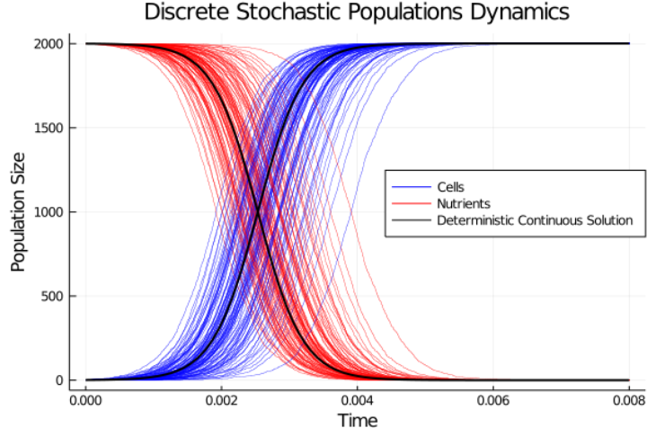

# Mathematical modelling of single cell mtDNA population dynamics

## During this project I hope to:

1. Learn how to program using the [Julia programming language](https://julialang.org/).
1. [Use mathematics to model](https://people.maths.bris.ac.uk/~madjl/course_text.pdf) [mtDNA](https://ghr.nlm.nih.gov/mitochondrial-dna) population dynamics in Julia.
1. Present my research in a report and poster at the end.

### Weekly Progress Reports:

#### [Week One Report](https://github.com/lwlss/MacPherson_2020/blob/master/markdown/week_review/week1.md)

#### [Week Two Report](https://github.com/lwlss/MacPherson_2020/blob/master/markdown/week_review/week2.md)

#### [Week Three Report](https://github.com/lwlss/MacPherson_2020/blob/master/markdown/week_review/week3.md)

#### [Week Four Report](https://github.com/lwlss/MacPherson_2020/blob/master/markdown/week_review/week4.md)

