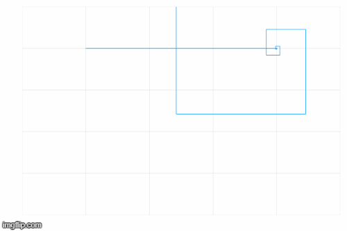

# Logistic Map Graph Animations

I managed to get the code running and I ended up generating 500 png files for each x0 and r varyation. I also managed to calculate how long it would take to generate 1 png file, and how many png files I would need to generate in order for it to run for an hour.

I used the `@time` command, got the value and then from that value figured out that it would take 18,000 png files to run for an hour, at one png file per 0.2 seconds:

```julia
@time begin
    fno = 1 # Frame counter
    for x0 in 0:1:1.0
    #for r in 0:0.01:5
        # Make a filename (within new directory) that is numbered
        # padded to 5 digits with zeros (i.e. 1 -> 00001)
        global fno
        fname = format("frames_time/frame{:05d}.png",fno)
        fno = fno + 1

        simres = logisticmap(x0=x0,r=4,n=100)
        #simres = logisticmap(x0=0.2,r=r,n=100)
        xvals = [x for (x, y) in simres]
        yvals = [y for (x, y) in simres]
        plot(xvals,yvals,legend=false,xaxis=false,yaxis=false,xlim=(0,1),ylim=(0,1));
        savefig(fname)
    end
end
```

For the r variation I changed the original code to this:

```julia
fno = 1
for r in 0:0.01:5
    global fno
    fname = format("frames_r/frame{:05d}.png",fno)
    fno = fno + 1

    simres = logisticmap(x0=0.2,r=r,n=100)
    xvals = [x for (x, y) in simres]
    yvals = [y for (x, y) in simres]
    plot(xvals,yvals,legend=false,xaxis=false,yaxis=false,xlim=(0,1),ylim=(0,1));
    savefig(fname)
end
```

I managed to make two versions of gif for the x0 variation and only one for the r variation.

For the first version of the gif I simply uploaded all of the png files I had onto a [gif making website](https://imgflip.com/gif-maker) to get [this](https://github.com/lwlss/MacPherson_2020/blob/master/code/logistic_map_x0.gif).


**Note that the frame rate is too fast here**

For the second version I managed to get ffmpeg working and when it came out it looked almost exactly the same (unsurprisingly) but I think the colours are a little different. You can find it [here](https://github.com/lwlss/MacPherson_2020/blob/master/frames/output.gif).


**Try this:**
```ffmpeg -framerate 12 -i frame%05d.png output.gif```

I didn't manage to get ffmpeg working with the r variation so I just did it with the website. I think this looks really cool and it looks exactly like the example on the Wikipedia page as well. You can find it [here](https://github.com/lwlss/MacPherson_2020/blob/master/code/logistic_map_r.gif).


