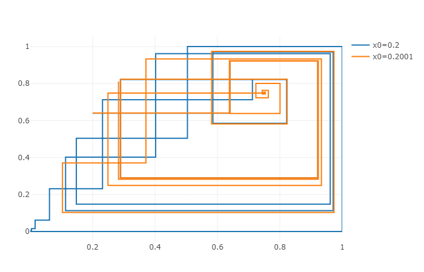
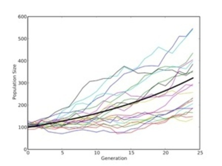

# Deterministic and Stochastic Models

### What are Deterministic and Stochastic models?

In deterministic models the output of the model's function is completely *determined* by the input values and the initial conditions of the function. This means that given the same input values and initial conditions, the output values will always be the exact same. There is no randomness in these systems. An example of a deterministic model/function is the logistic map function:

In stochastic models there is an element of randomness, as given the same input values and initial conditions, the output values will *not* always be the same, although they will tend towards the same trends. An example of a stochastic model is modelling populations growth:

### What are Deterministic and Stochastic models used for?

###### Stochastic Models

Stochastic models are used when the true variables are not apparent. What this means is that if the initial conditions and affecting variables are not apparent, extremely difficult or almost impossible to ascertain, then a stochastic model can be used to get the most probable results from random - but intended - variations in input values. For example, when trying to model the population of an ant colony, it would be almost impossible to find out all of the factors affecting the colony's positive or negative growth and therefore a stochastic model can be used to find a realistic and general value for population size.

In a stochastic model the input(s) are randomly variated, usually in accordance with pre-existing data in order to get the most accurate and reliable output. The variations can be averaged, a line of best fit can be established and conclusions drawn from the data.

Stochastic models are also used frequently in modelling human biological processes as often ethical boundaries prevent direct data being taken, so stochastic models provide an easy, ethical and cheap way of conduction experiments and gathering data.

###### Deterministic Models

In contrast to stochastic modelling, deterministic modelling can be used when the initial conditions and affecting variables are known, get a very accurate output.
