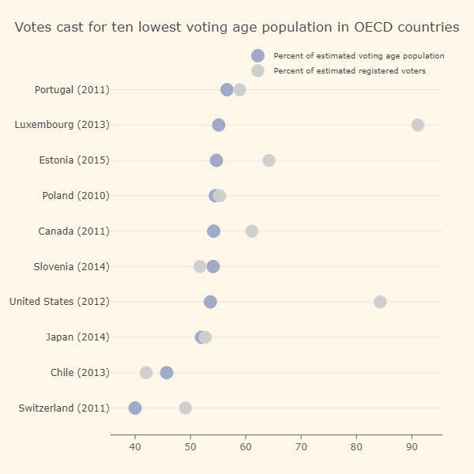
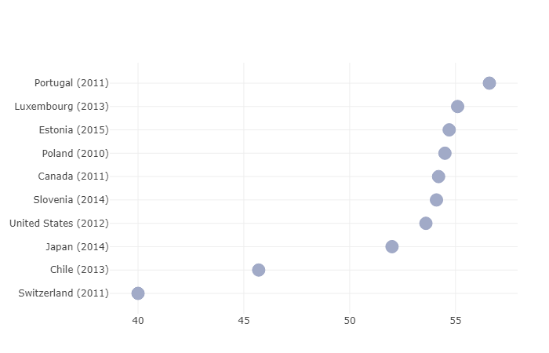

# Ploting Logistic Map

So far I've been trying to use the PlotlyJS package to graph a logistical map, as I found a [GitHub repo](https://github.com/JuliaPlots/PlotlyJS.jl) with a fairly comprehensive guide on what you can do with the PlotlyJS package including [a section on scatter graphs](https://github.com/JuliaPlots/PlotlyJS.jl/blob/master/examples/line_scatter.jl).

In the section with scatter graphs I took the first example:
```julia
function linescatter1()
    trace1 = scatter(;x=1:4, y=[10, 15, 13, 17], mode="markers")
    trace2 = scatter(;x=2:5, y=[16, 5, 11, 9], mode="lines")
    trace3 = scatter(;x=1:4, y=[12, 9, 15, 12], mode="lines+markers")
    plot([trace1, trace2, trace3])
end
```

and tried to incorporate the function for logistic maps that I had made previously into it:
```julia
function logisticmaping()
    trace1 = scatter(;x=xold, y=xnew, mode="lines+markers")
    plot([trace1])
end

# and this way as well

function logisticmaping()
    function logisticmap(x0=0.2,r=4,n=10)
        results = [(x0,logistic(r,x0))];
        N = 100;
        for i in 1:(N-1)
          xold = results[end][2]
          xnew = logistic(r,xold)
          append!(results,[(xold,xnew)])
          print(results)
      end
      results
    end
    trace1 = scatter(;x=xold, y=xnew, mode="lines+markers")
    plot([trace1])
end
```

My idea was to define the `logisticmap` function, then use the outputs/inputs of `xold` and `xnew` for the x and y-axes.

I had also ran another example from the GitHub repo in my repl:
```julia
function linescatter5()

    country = ["Switzerland (2011)", "Chile (2013)", "Japan (2014)",
               "United States (2012)", "Slovenia (2014)", "Canada (2011)",
               "Poland (2010)", "Estonia (2015)", "Luxembourg (2013)",
               "Portugal (2011)"]

    votingPop = [40, 45.7, 52, 53.6, 54.1, 54.2, 54.5, 54.7, 55.1, 56.6]
    regVoters = [49.1, 42, 52.7, 84.3, 51.7, 61.1, 55.3, 64.2, 91.1, 58.9]

    # notice use of `attr` function to make nested attributes
    trace1 = scatter(;x=votingPop, y=country, mode="markers",
                      name="Percent of estimated voting age population",
                      marker=attr(color="rgba(156, 165, 196, 0.95)",
                                  line_color="rgba(156, 165, 196, 1.0)",
                                  line_width=1, size=16, symbol="circle"))

    trace2 = scatter(;x=regVoters, y=country, mode="markers",
                      name="Percent of estimated registered voters")
    # also could have set the marker props above by using a dict
    trace2["marker"] = Dict(:color => "rgba(204, 204, 204, 0.95)",
                           :line => Dict(:color=> "rgba(217, 217, 217, 1.0)",
                                         :width=> 1),
                           :symbol => "circle",
                           :size => 16)

    data = [trace1, trace2]
    layout = Layout(Dict{Symbol,Any}(:paper_bgcolor => "rgb(254, 247, 234)",
                                     :plot_bgcolor => "rgb(254, 247, 234)");
                    title="Votes cast for ten lowest voting age population in OECD countries",
                    width=600, height=600, hovermode="closest",
                    margin=Dict(:l => 140, :r => 40, :b => 50, :t => 80),
                    xaxis=attr(showgrid=false, showline=true,
                               linecolor="rgb(102, 102, 102)",
                               titlefont_color="rgb(204, 204, 204)",
                               tickfont_color="rgb(102, 102, 102)",
                               autotick=false, dtick=10, ticks="outside",
                               tickcolor="rgb(102, 102, 102)"),
                    legend=attr(font_size=10, yanchor="middle",
                                xanchor="right"),
                    )
    plot(data, layout)
end
```

Which graphed some made up data in this form:



I then tried to input one of the previous functions that I had made, but must have mixed them with the above one (I think because they both use "trace1") so I ended up with something that I think looks correct, however it has been plotted with the y-axis from above:

**I've just realised that this is just a more zoomed in version of the above graph without the paler dots**



I haven't however been able to reproduce this frustratingly. I initially thought that to plot it without the weird y and x-axes values I should restart Atom so as to clear the REPL but after I've done this I haven't been able to get any success with the functions I showed at the beginning e.g:

```julia
function logisticmaping1()
    trace1 = scatter(;x=xold, y=xnew, mode="lines+markers")
    plot([trace1])
end


function logisticmaping2()
    function logisticmap(x0=0.2,r=4,n=10)
        results = [(x0,logistic(r,x0))];
        N = 100;
        for i in 1:(N-1)
          xold = results[end][2]
          xnew = logistic(r,xold)
          append!(results,[(xold,xnew)])
          print(results)
      end
      results
    end
    trace1 = scatter(;x=xold, y=xnew, mode="lines+markers")
    plot([trace1])
end
```

Whenever I try the first function, after I have put in `using PlotlyJS`, defined;
```julia
function logistic(r,x)
    r*x*(1.0-x)
end
```
and the logistic map function;

```julia
function logisticmap(x0=0.2,r=4,n=10)
    results = [(x0,logistic(r,x0))];
    N = 100;
    for i in 1:(N-1)
      xold = results[end][2]
      xnew = logistic(r,xold)
      append!(results,[(xold,xnew)])
      print(results)
  end
  results
end
```
it gives the error:


When I've gone back and defined xold as `xold = results[end][2]` it then says xnew isn't defined and then when I define that it plots a blank graph. I also think that by doing this it completely defeats the point of having the logisticmap function in there if I have to manually define x old and new. My idea/thought was to include the logisticmap function in the logisticmaping function so it would automatically generate a long series of coordinates that would then be plotted but it doesn't seem to be working regardless of if I include the logisticmap function within the logisticmaping function or define it beforehand.

At this point I'm not exactly sure what to do. The reason I haven't tried using the turtle package yet is due to the fact that I can't find any information online about how to plot using it, rather just to [make shapes](http://juliagraphics.github.io/Luxor.jl/v0.8.3/turtle.html), and also I don't really know how I would go about graphing it. I was thinking maybe to draw an x-axis, reposition it to 0, draw a y-axis, then somehow get it to go to coordinates but I really don't know how I would do this yet alone turn it into a function, although I try do what I've just suggested and see if it'll work.

I hope this wasn't to incoherent and that you can understand my train of thought in what I've been doing today.
