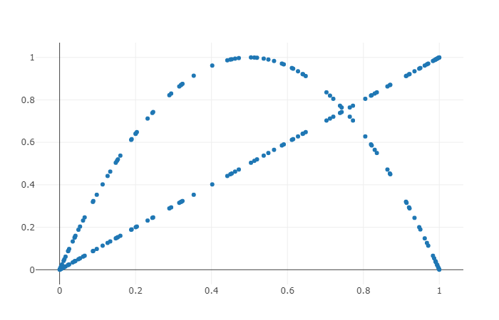
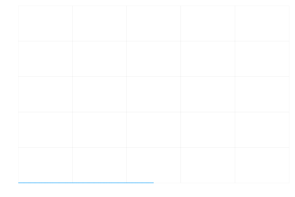

# The Logistic Map

The [logistic map](https://en.wikipedia.org/wiki/Logistic_map#:~:text=The%20logistic%20map%20is%20a,simple%20non%2Dlinear%20dynamical%20equations.) is a nonlinear recurrence relation equation. "Nonlinear" eluding to  the chaotic nature of the logistic map function.

The function itself is represented as:

###### Xn+1 = rXn (1 - Xn)

On first glance it looks like a fairly standard, simple and predictable equation, however it produces graphs that show chaotic behavior.

When iterating the above equation multiple times it produces the following graph:

When iterating whilst varying `x0` it produces the following images:

As you can see towards the end it displays chaotic behaviour and this is one of the first ways used to generate random numbers on deterministic machines like computers. Although appearing to be random, if given the exact input values the exact same output could be achieved therefore making it only pseudo-random. This is an example of deterministic chaos. As `r` increases between 0 and 5 in this example it shows to behave chaotically towards the end at values of 3-5.

An informative video that touches on the logistic map function and also the bifurcation diagram can be found [here](https://www.youtube.com/watch?v=ovJcsL7vyrk).
