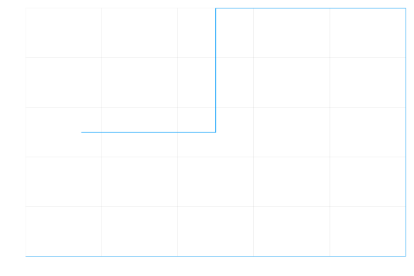

# The Logistic Map

The [logistic map](https://en.wikipedia.org/wiki/Logistic_map#:~:text=The%20logistic%20map%20is%20a,simple%20non%2Dlinear%20dynamical%20equations.) is a nonlinear recurrence relation equation. "Nonlinear" meaning the outputs do not change in direct proportion to changes in the input arguments.

The function itself is represented as:

###### X<sub>n+1</sub> = rX<sub>n</sub> (1 - X<sub>n</sub>)

On first glance it looks like a fairly standard, simple and predictable equation, however it produces graphs that show chaotic behavior.

When iterating the above equation multiple times it produces the following graph:


When iterating whilst varying `x0` it produces the following animation:


When iterating whilst varying `r` the function produces the following animation:


And finally when varying the number of iterations, `n` the function produces the following graph:


As you can see towards the end it displays chaotic behaviour and this is one of the first ways used to generate random numbers on deterministic machines like computers. Although appearing to be random, if given the exact input values the exact same output could be achieved therefore making it only pseudo-random. This is an example of deterministic chaos. As `r` increases between 0 and 5 in this example it shows to behave chaotically towards the end at values of 3-5.

The chaotic and unpredictable nature of this function can be seen most clearly in the following example:


In this example two different values of `x0` were plotted with the same value of `r` and the same number of iterations, however, with only a 0.0001 difference in `x0` values the graph displays a large difference between the `x0` value of 0.2 in blue and the `x0` value of 0.2001 in orange. This shows how much the initial conditions of the function can almost completely change the look of the output. As seen here only a small change can lead to a big change and is a good example of the nonlinear nature of this equation. This is called sensitivity to initial conditions. In this case high sensitivity.

The differences and also similarities can perhaps be seen better here:


Although the orange markers seem to be in different places from the blue ones, they still plot in the same shape, showing clearly that although at first it may appear random, they follow the constraints of the function and therefore are only pseudo random.
##### X<sub>n+2</sub> = X<sub>n</sub>

Using the website [Wolfram Alpha](https://www.wolframalpha.com/) I managed to solve the equation   X<sub>n+2</sub> = X<sub>n</sub> for X<sub>n</sub> . The values of Xn I was returned were:


By inputting these values into the above code for the values of X, I managed to get a sequence of 10 images which showed a stable set of images:

```julia
r = 4.0
x = (r+sqrt(r-4)*sqrt(r))/(2*r)
vary("xn+2";x0_vals=[x] ,r_vals=[r], nvals=1:10)
```


When the code is run again, this time by adding ε epsilon (a very small number) onto the value of x seen below, it quickly destabilises the system and causes chaotic behaviour typically seen in the logistic map to occur once again:

```julia
r = 4.0
x = (r+sqrt(r-4)*sqrt(r))/(2*r)
vary("xn+2";x0_vals=(x+0.00001),r_vals=r, nvals=1:50) # here the `0.00001` represents epsilon
```


##### X<sub>n+3</sub> = X<sub>n</sub>

Using wolfram Alpha once again, the roots of the equation X<sub>n+3</sub> = X<sub>n</sub> for Xn can be found to be:


By inputting just one of the above solutions into the `vary` function for the values of X and running for 10 iterations, a stable set of identical images will be produced:

```julia
r = 4
x = (1/2)*(1-sqrt(-(2sqrt(r-4))/r^(3/2)-2/r+1))
vary("xn+3";x0_vals=(x),r_vals=r, nvals=1:50)
```



When the code is run again, but this time by adding ε epsilon onto the value of x seen below, it quickly destabilises the system and causes chaotic behaviour typically seen in the logistic map to occur once again:

```julia
r = 4
x = (1/2)*(1-sqrt(-(2sqrt(r-4))/r^(3/2) - 2/r + 1))
vary("xn+3";x0_vals=(x+0.00001),r_vals=r, nvals=1:50) # here the `0.00001` represents epsilon
```


An informative video that touches on the logistic map function and also the bifurcation diagram can be found here:

<a href="http://www.youtube.com/watch?feature=player_embedded&v=ovJcsL7vyrkE
" target="_blank"></a>
