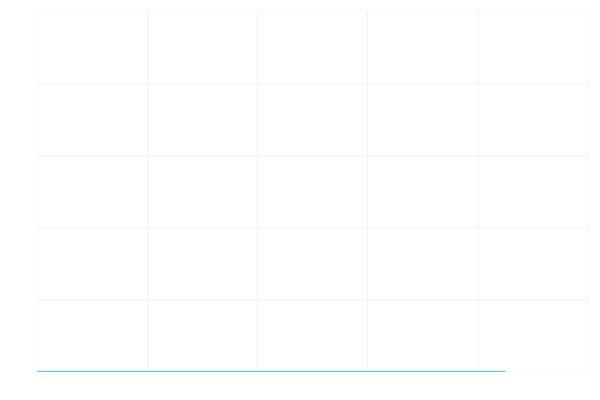
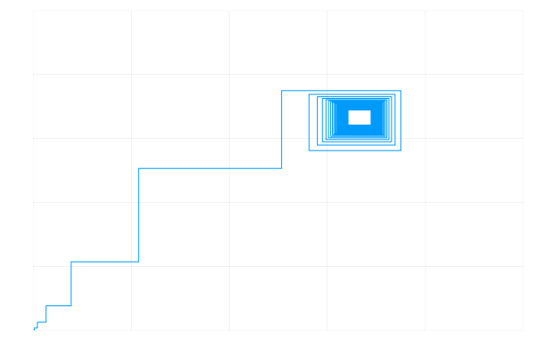
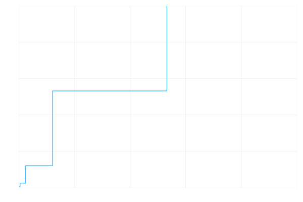

# Week Two

## Monday

Carrying on from the previous [week](https://github.com/lwlss/MacPherson_2020/blob/master/markdown/week_review/weekone.md), my task was to plot the points generated by my `logisticmap` function.

I tried a couple different things using the PlotlyJS and [Luxor](http://juliagraphics.github.io/Luxor.jl/v0.8.3/index.html) packages, but had no success so instead I made a [markdown file](https://github.com/lwlss/MacPherson_2020/blob/master/markdown/graphinghelp.md) - explaining everything I had attempted and included some questions and ideas I had - to send to my project supervisor, Conor Lawless, to explain fully my problems and to get the help that I needed.

I also tried to find out more about the logistic map equation by watching [this](https://www.youtube.com/watch?v=ovJcsL7vyrk&t=928s) very interesting and informative video on YouTube.

## Tuesday

On Tuesday I spent some time working on the plotting problem I had the main issue was to extract the information I needed from the `logisticmap` function so as to be able to plot it. I found a very [useful website](https://github.com/JuliaPlots/PlotlyJS.jl) which showed all of the capabilities of the PlotlyJS package, which included a [section](https://github.com/JuliaPlots/PlotlyJS.jl/blob/master/examples/line_scatter.jl) on scatter graphs which was exactly what I needed.

With some help from a friend I used the following code to extract the information I needed from the `logisticmap` function so I could then plot it. Then afterwards with some help I improved it by making it into a more concise list comprehension:

###### My Initial Code

```julia
simres = logisticmap(x0=0.21,r=4,n=100)

xvals = []
yvals = []

for (x, y) in simres
    append!(xvals, x)
    append!(yvals, y)
end

trace = scatter(;x=xvals, y=yvals, mode="markers")
plot(trace)
```
###### The Improved Version
```julia
simres = logisticmap(x0=0.21,r=4,n=100)

xvals = [x for (x, y) in simres]
yvals = [y for (x, y) in simres]

trace = scatter(;x=xvals, y=yvals, mode="markers")
plot(trace)
```

This then output this graph:


I also managed to get a very similar plot drawn with [Turtle](http://juliagraphics.github.io/Luxor.jl/v0.8.3/turtle.html). I made a function which would draw cross at each coordinate and then used the following code to create the following image:

```julia
function cross(turtle)
    Forward(turtle, 5)
    Turn(turtle, 180)
    Forward(turtle, 10)
    Turn(turtle, 180)
    Forward(turtle, 5)
    Turn(turtle, 90)
    Forward(turtle, 5)
    Turn(turtle, 180)
    Forward(turtle, 10)
    Turn(turtle, 180)
end

turtle = Turtle()
Pencolor(turtle, "black")
Penwidth(turtle, 1.5)
Reposition(turtle, 100*simres[1][1], -100*simres[1][2])
Pendown(turtle)
for (x, y) in simres
    Reposition(turtle, 100*x, -100*y)
    #Pendown(turtle)
    #cross(turtle)
end
finish()

Drawing(1000,1000,"turtlegraph.png")
origin()
background("white")

turtle = Turtle()
Pencolor(turtle, "black")
Penwidth(turtle, 1.5)
for (x, y) in simres
    Reposition(turtle, 250*x, -250*y)
    Pendown(turtle)
    cross(turtle)
end
finish()
```


I also re-organised the files and directories in my GitHub repository to make it more manageable as I add more and more work each week.

## Wednesday

On Wednesday I was given the task to generate multiple PNG files in order to make an animation by stringing the images together. I did so with the following code:

```julia
fno = 1
for x0 in 0:0.01:1 # This means that the code will generate PNGs for x0's values from 0 to 1 in increments of 0.01
    global fno
    fname = format("frames/frame{:05d}.png",fno)
    fno = fno + 1

    simres = logisticmap(x0=x0,r=4,n=100)
    xvals = [x for (x, y) in simres]
    yvals = [y for (x, y) in simres]
    plot(xvals,yvals,legend=false,xaxis=false,yaxis=false,xlim=(0,1),ylim=(0,1));
    savefig(fname)
end
```
To turn the PNG files created by this code into an animation I had to use a programme called [ffmpeg](https://ffmpeg.org/) and then edit the system path. I followed the guide on [this](https://www.architectryan.com/2018/03/17/add-to-the-path-on-windows-10/) website to help me do this. I used an initial command to do this but this didn't work with the `r` variation and altered the colours a little bit so for the following GIFs I used a new and improved ffmpeg command: `ffmpeg -i frame%05d.png -vf "fps=12,split[s0][s1];[s0]palettegen[p];[s1][p]paletteuse" -loop 0 output.gif`.

I'm glad that I learned about ffmpeg as prior to using it I had never heard of it and didn't realise the massive scope on which it operates and how I had probably used it indirectly countless times beforehand. I would say that it is rather difficult to use for the first time but it would definitely be worth investing some time into learning it as it is used on a global scale on likely every corner of the internet.

Once I had ffmpeg installed I turned both `x0` and `r` variations into GIFs and here is how they turned out:

###### x0 variable


###### r variable


Another one of my tasks for Wednesday was to calculate how long it takes for Julia to generate one PNG file and then using that information to calculate how many PNGs I could generate in an hour. To do this I used the `@time` command:

```julia
@time begin
    fno = 1
    for x0 in 0:1:1.0
        global fno
        fname = format("frames_time/frame{:05d}.png",fno)
        fno = fno + 1

        simres = logisticmap(x0=x0,r=4,n=100)
        xvals = [x for (x, y) in simres]
        yvals = [y for (x, y) in simres]
        plot(xvals,yvals,legend=false,xaxis=false,yaxis=false,xlim=(0,1),ylim=(0,1));
        savefig(fname)
    end
end
```
It calculated that it takes Julia 0.2 seconds to generate one PNGs file, so it would generate 18,000 PNG files in an hour.

## Thursday

My task for Thursday was to create a function with the input arguments of `x0`, `r` and `dname` (name of directory in which the generated files are placed).

I came up with the following function:

```julia
function graphpngs(x0, delta_r, dname)
    if !isdir(dname)
        mkdir(dname)
    end
    fno = 1
    global fno
    for r in 0:delta_r:5
        fname = format(dname*"/frame{:05d}.png",fno)
        fno = fno + 1
        simres = logisticmap(x0=x0, r=r, n=100)
        xvals = [x for (x, y) in simres]
        yvals = [y for (x, y) in simres]
        plot(xvals,yvals,legend=false,xaxis=false,yaxis=false,xlim=(0,1),ylim=(0,1));
        savefig(fname)
    end
end
```

With this I can enter the starting value of x (`x0`), the rate of increase for the varying r (`delta_r`) and the name of directory (`dname`). In this example `r` is varied and x0 is fixed but by changing it to the code below x0 is now varied and r is fixed:

```julia
function graphpngs(delta_x0, r, dname)
    if !isdir(dname)
        mkdir(dname)
    end
    fno = 1
    global fno
    for x0 in 0:delta_x0:1
        fname = format(dname*"/frame{:05d}.png",fno)
        fno = fno + 1
        simres = logisticmap(x0=x0, r=r, n=100)
        xvals = [x for (x, y) in simres]
        yvals = [y for (x, y) in simres]
        plot(xvals,yvals,legend=false,xaxis=false,yaxis=false,xlim=(0,1),ylim=(0,1));
        savefig(fname)
    end
end
```

## Friday

On Friday my task for the day was to create a function that generates PNG files that vary `r` or `x0` depending on input arguments. To do this I defined two functions each varying either `r` or `x0` and then another function which when given the input argument of `v` would execute one of the functions:

```julia
function varyx0(delta_x0, r, dname)
    if !isdir(dname)
        mkdir(dname)
    end
    fno = 1
    global fno
    for x0 in 0:delta_x0:1
        fname = format(dname*"/frame{:05d}.png",fno)
        fno = fno + 1
        simres = logisticmap(x0=x0, r=r, n=100)
        xvals = [x for (x, y) in simres]
        yvals = [y for (x, y) in simres]
        plot(xvals,yvals,legend=false,xaxis=false,yaxis=false,xlim=(0,1),ylim=(0,1));
        savefig(fname)
    end
end

function varyr(x0, delta_r, dname)
     if !isdir(dname)
         mkdir(dname)
     end
     fno = 1
     global fno
     for r in 0:delta_r:5
         fname = format(dname*"/frame{:05d}.png",fno)
         fno = fno + 1
         simres = logisticmap(x0=x0, r=r, n=100)
         xvals = [x for (x, y) in simres]
         yvals = [y for (x, y) in simres]
         plot(xvals,yvals,legend=false,xaxis=false,yaxis=false,xlim=(0,1),ylim=(0,1));
         savefig(fname)
     end
end

function varyxr(x0, r, dname, v)
    if v==1
        varyx0(x0, r, dname)
    elseif v==2
        varyr(x0, r, dname)
    else
        println("To vary x0 set v to 1, to vary r set v to 2")
    end
end
```

Then, using the function `varyxr` I generated six different GIFs, half for the varying `r` and half for varying `x0`.

#### Varying `x0`

###### `x0` = 0.02


###### `x0` = 0.5


###### `x0` = 0.85



#### Varying `r`

###### `r` = 3



###### `r` = 4


###### `r` = 5



Then I spent the rest of the day writing this report.
