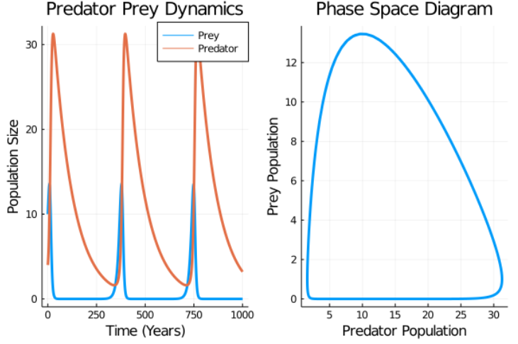

# Week Three

## Simulating Population Dynamics

## Difference Equations

### Vary Function Update

I expanded on last week's work on vary the input values for the logistic map using the `vary` function. I added to the code to allow me to vary the value of `n`. Doing this allows you to see clearly how the logistic map is "drawn", shows how it is "built up" with each iteration and shows the chaotic nature of it. Here is the adjusted code and GIF animation it produced:

```julia
function vary(dname;x0_vals=[],r_vals=[], nvals=[])
 if !isdir(dname)
  mkdir(dname)
 end
 fno = 1
 for x0 in x0_vals
  for r in r_vals
      for n in nvals
          fname = format(dname*"/frame{:05d}.png",fno)
          fno = fno + 1
          simres = logisticmap(x0=x0, r=r, n=n)
          xvals = [x for (x, y) in simres]
          yvals = [y for (x, y) in simres]
          plot(xvals,yvals,legend=false,xaxis=false,yaxis=false,xlim=(0,1),ylim=(0,1));
          savefig(fname)
        end
    end
end
end
```


## Logistic Map Document

I made a [markdown file](https://github.com/lwlss/MacPherson_2020/blob/master/markdown/logistic_maps.md) talking about the logistic map function. In which I managed to embed a YouTube video and alter code for the logistic map to show two different values of `x0` on the same graph which I think helps to visualise the chaotic but also deterministic qualities of the logistic map function.

Double Line Graph:


YouTube Video:

<a href="http://www.youtube.com/watch?feature=player_embedded&v=ovJcsL7vyrkE
" target="_blank"></a>

## Ordinary Differential Equations

### Exponential and Logistic Growth Equations

I started looking at differential equations and how to solve them in Julia. Firstly I looked at [two types](https://lwlss.net/talks/MathModel.pdf) (pages 4 & 5) of differential equations: exponential and logistic growth equations. The exponential growth equation looks like this:

*dN(t)/dt = rN(t)*

the logistic growth equation looks like this:

*dN(t)/dt = rN(t)(1-(N(t)/K))*

I found it useful to write down these two ODEs for two main reasons. The first being that it is nice to have a visual representation of the ODEs that I'm trying to model and the second reason is that you can solve them to find the analytical solutions for each of these equations, although only because they are particularly simple and normally analytical solutions are not achievable for more complex ODEs. As you will see in the following blocks of code for the exponential and logistic growth maps, at the bottom an extra `plot!` function has been used to add the "true solution" onto the graphs. For ODEs without analytical solutions the "true solution/line" can never be exactly plotted, but can be made more accurate by increasing the tolerance.

I used the [DifferentialEquations.jl](https://diffeq.sciml.ai/stable/) Julia package to solve these within Julia.

Firstly I wrote the code to solve the exponential growth equation:

```julia
using DifferentialEquations
using Plots; gr()

f(u,p,t) = p[1]*u   # Here the ODE itself is written. p[1] representing r and u representing N
u0 = 0.5            # Defining u0
p = [3.0]           # Defining p[1]
tspan = (0.0,1.0)
prob = ODEProblem(f,u0,tspan,params)
sol = solve(prob,reltol=1e-7,abstol=1e-7)

plot(sol,linewidth=5,title="Solution to the linear ODE with a thick line",
     xaxis="Time (d)",yaxis="Population size",label="Numerical solution")
```
The analytical solution can be found the following way:


I then added the analytical solution or "true line" to the graph with the following code:

```julia
plot!(sol.t,t->u0*exp(p[1]t),lw=3,ls=:dash,label="True Solution")
```

When all of the above code is run together it plots this exponential graph:


Then I wrote the code to solve the logistic growth equation:

```julia
f(u,p,t) = p[1]*u*(1-(u/p[2]))   # This is where the logistic growth ODE is written.
u0 = 0.1                         # p[1] representing r, u representing N and p[2] representing K.
p = [5.0,1.0]       # Here is an array in which both p[1] and p[2] are defined as elements of it.
tspan = (0.0, 10.0)
prob2 = ODEProblem(f, u0, tspan, p)
sol2 = solve(prob2,reltol=1e-8,abstol=1e-8)

plot(sol2,linewidth=5,title="Logistic ODE Graph",
     xaxis="Time (s)",yaxis="Population size",label="Numerical Solution", legend=:bottomright)
```

The analytical solution can be found to be:


This can be written into Julia with the following code:

```julia
plot!(sol2.t,t->((p[2])*(u0*exp(p[1]t)))/(p[2]+(u0*(exp(p[1]t)-1))),lw=3,ls=:dash,label="True Solution")
```

Then when the above code is plotted it outputs this logistic graph:


### Lotka-Volterra Predator-Prey Model

The Lotka-Volterra Model is a biological model which models the relationship between predators and prey, using two differntial equations. I read about this in the textbook ["Stochastic Modelling for Systems Biology"](https://www.staff.ncl.ac.uk/d.j.wilkinson/smfsb/2e/) by Darren J. Wilkinson on page 40.


I wrote the following code in Julia to model the relationship between predator and prey:

```julia
using DifferentialEquations
using Plots; gr()

function f(du,u,p,t)
    du[1] = (p[1]*u[1]) - (p[2]*u[1]*u[2])
    du[2] = (p[2]*u[1]*u[2]) - (p[3]*u[2])
end
u0 = [4.0;10.0]
p = [1.0;0.1;0.1]
tspan = (0.0, 100.0)
prob = ODEProblem(f,u0,tspan,p)

sol = solve(prob,reltol=1e-7,abstol=1e-7)

plot(sol,linewidth=5,title="Lotka-Volterra System/Predator Prey Dynamics",
     xaxis="Time (years)",yaxis="Population size",label=["Prey" "Predator"], legend =:topright)
```

The above code was adapted from the following ODE's from Wilkinson's book.


In these equations, `Y1` represents the prey and `Y2` represents the predators. `K1`, `K2` and `K3` are the input parameters and each represent a different aspect of the overall function. `K1` represents the growth - or reproduction - rate of the prey, `K2` the constant of proportionality and `K3` the negative growth - or death - rate of the predators.

What we should expect to see is the populations of predator and prey oscillating.

Along with input values from Wilkinson's book on page 196 it output this graph:


As expected, we can see the populations of both predator and prey oscillating. To help understand this graph we can think of the interactions between predator and prey in the following way. Predators will kill prey, increasing their population and decreasing the population of the prey. This can be seen initially at around 3 years into the graph. Then, when there are less prey to eat, the population of predators falls and consequently the population of prey will increase, and there are less predators to eat them. This cycle is repeated - in this particular example - just over every twenty years.

When changing some of the input values such as increasing the initial population of prey and decreasing initial population of predators, increasing reproduction rate of prey and death rate of predators, the graph changes to this:


The Lotka-Volterra model can also be graphed in [phase space](https://en.wikipedia.org/wiki/Phase_space#:~:text=In%20dynamical%20system%20theory%2C%20a,of%20position%20and%20momentum%20variables.), showing all possible states of a system and in this case all possible states of the Lotka-Volterra model. Here is the LV model next to the phase space diagram of the same model:



You will notice that the phase space diagram has plotted a loop. This is because the model is repetitive and predictable, meaning that the predator and prey populations will only ever be the number that is prescribed in the phase space diagram.

### Lorenz Attractor

The [Lorenz Attractor](https://en.wikipedia.org/wiki/Lorenz_system) is a system of three ODEs devised by [Edward Lorenz](https://en.wikipedia.org/wiki/Edward_Norton_Lorenz), an American meteorologist. Whilst attempting to model [atmospheric convection](https://en.wikipedia.org/wiki/Atmospheric_convection#:~:text=Atmospheric%20convection%20is%20the%20result,air%20masses%20lead%20to%20instability.) he discovered chaotic properties in the ODEs he was working with. These set of equations became known as the Lorenz Equations:


Using the following code in Julia I modelled the Lorenz System:

```julia
using Plots; gr()
using DifferentialEquations

# Lorenz example from documentation
function g(du,u,p,t)
 du[1] = p[1]*(u[2]-u[1])
 du[2] = u[1]*(p[2]-u[3]) - u[2]
 du[3] = u[1]*u[2] - p[3]*u[3]
end
u0 = [1.0;0.0;0.0]
tspan = (0.0,180.0)
p = [10.0,28.0,8/3]
prob = ODEProblem(g,u0,tspan,p)

sollor = solve(prob,reltol=1e-14,abstol=1e-14)

plot(sollor)
```
This produced the following plot:


Then, when plotted in state space it produces the following image:


I also watched this helpful and interesting video which talks about the Lorenz Attractor and it's origins:

<a href="http://www.youtube.com/watch?feature=player_embedded&v=fDek6cYijxI
" target="_blank"></a>

## Deterministic and Stochastic Models

I read in Darren J. Wilkinson's book about deterministic and stochastic models. I read about what they are and when to use them and then wrote a markdown document about them which can be found [here.](https://github.com/lwlss/MacPherson_2020/blob/master/markdown/deterministic_and_stochastic_models.md)

## Report

As with every week, on Friday I wrote this report about what I have done throughout the week.
