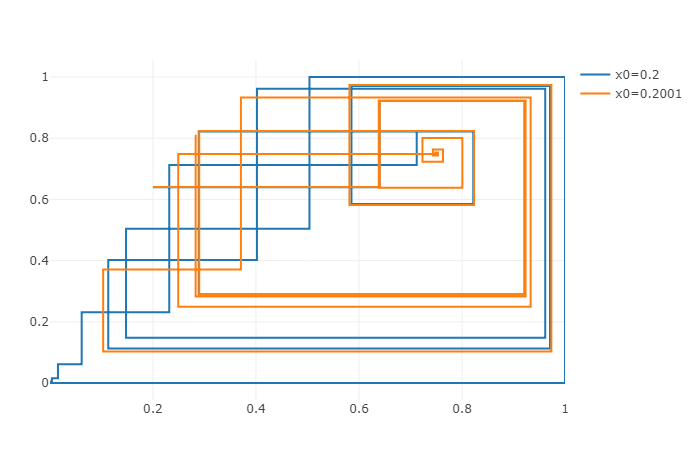

# Week Three

## Vary Function Update

I expanded on last week's work on vary the input values for the logistic map using the `vary` function. I added to the code to allow me to vary the value of `n`. Doing this allows you to see clearly how the logistic map is "drawn", shows how it is "built up" with each iteration and shows the chaotic nature of it. Here is the adjusted code and GIF animation it produced:

```julia
function vary(dname;x0_vals=[],r_vals=[], nvals=[])
 if !isdir(dname)
  mkdir(dname)
 end
 fno = 1
 for x0 in x0_vals
  for r in r_vals
      for n in nvals
          fname = format(dname*"/frame{:05d}.png",fno)
          fno = fno + 1
          simres = logisticmap(x0=x0, r=r, n=n)
          xvals = [x for (x, y) in simres]
          yvals = [y for (x, y) in simres]
          plot(xvals,yvals,legend=false,xaxis=false,yaxis=false,xlim=(0,1),ylim=(0,1));
          savefig(fname)
        end
    end
end
end
```


## Logistic Map Document

I made a [markdown file](https://github.com/lwlss/MacPherson_2020/blob/master/markdown/logistic_maps.md) talking about the logistic map function. In which I managed to embed a YouTube video and alter code for the logistic map to show two different values of `x0` on the same graph which I think helps to visualise the chaotic but also deterministic qualities of the logistic map function.

Double Line Graph:



YouTube Video:

<a href="http://www.youtube.com/watch?feature=player_embedded&v=ovJcsL7vyrkE
" target="_blank"></a>

## Differential Equations

### Exponential and Logistic Growth Equations

I started looking at differential equations and how to solve them in Julia. Firstly I looked at [two types](https://lwlss.net/talks/MathModel.pdf) (pages 4 & 5) of differential equations: exponential and logistic growth equations. The exponential growth equation looks like this:

*dN(t)/dt = rN(t)*

the logistic growth equation looks like this:

*dN(t)/dt = rN(t)(1-(N(t)/K))*

I used the [DifferentialEquations.jl](https://diffeq.sciml.ai/stable/) Julia package to solve these within Julia.

Firstly I wrote the code to solve the exponential growth equation:

```julia
using DifferentialEquations
using Plots; gr()

f(u,p,t) = p[1]*u
u0 = 0.5
#params = [3.0]
p = [3.0]
tspan = (0.0,1.0)
prob = ODEProblem(f,u0,tspan,params)

sol = solve(prob,reltol=1e-7,abstol=1e-7)

plot(sol)

plot(sol,linewidth=5,title="Solution to the linear ODE with a thick line",
     xaxis="Time (d)",yaxis="Population size",label="Numerical solution")

plot!(sol.t,t->u0*exp(p[1]t),lw=3,ls=:dash,label="True Solution")
```

This code plotted this exponential graph:


Then I wrote the code to solve the logistic growth equation:

```julia
f(u,p,t) = p[1]*u*(1-(u/p[2]))
u0 = 0.1
p = [5.0,1.0]
tspan = (0.0, 10.0)
prob2 = ODEProblem(f, u0, tspan, p)
sol2 = solve(prob2,reltol=1e-8,abstol=1e-8)

plot(sol2)

plot(sol2,linewidth=5,title="Logistic ODE Graph",
     xaxis="Time (s)",yaxis="Population size",label="Numerical Solution", legend=:bottomright)

plot!(sol2.t,t->((p[2])*(u0*exp(p[1]t)))/(p[2]+(u0*(exp(p[1]t)-1))),lw=3,ls=:dash,label="True Solution")
```

This code plotted this logistic graph:


### Lotka-Volterra Model

The Lotka-Volterra Model is a biological model which models the relationship between predators and prey, using two differntial equations. I read about this in the textbook ["Stochastic Modelling for Systems Biology"](https://mail-attachment.googleusercontent.com/attachment/u/1/?ui=2&ik=709cc05d41&attid=0.1&permmsgid=msg-f:1672754042712343355&th=1736d0f07077c33b&view=att&disp=inline&realattid=f_kcuq0isz0&saddbat=ANGjdJ-RlzsDz6fzOS11dVAZX9t19U0OuJOcs07zRwnstB7wQVZqec-xGIFnMMbLNoh3NCOtSdApldlZPPM27hxoKb87GTVFj2eQEc_Fg49B7qBtfE0HQ09cy1iD8E_wMcV6hNmKjkQ2G5zqIhOK3SqVNhnUcJ9uM7nivONm9Y3QGC0QuPllc0z_j4NKc70Gs9_IPBfDgWfVJBvoujDYo_NNLI9PM39y-M2S_y_RszMfxBL6_cySk8jlOBtQs7k0IGSK61nPxyL3kA5Z6clHW-RvfHApIEozBHgn1SFS5qqDS-ilYVNa9Ma-pEm1GCEPvQZr-fFlc9GpoeVia1hYG70oEo-XOSRBjR_0DpqrVAUs7V1YBw5pAMxlu3___f3xD5mL7WPgiQ3SYaMiKzTZ1EQgiYch_B-sZ6fwkMLeWlZ6X-pXbny5G8D96BGQ28fXL1Z9yLB5jDby8BQ_f_BdAntWHE36HjidYC13XuGCQzW1JMmS_-rRMwPlWAZR78qK5I-lCcnjatinA1ZMn80euLx7CwJag7Jgt2P2Sn2wz4Xtpn1JtcRpoJtzjaofsK3jaNqA5piZEV34mMgXMuN6DknINknskv36mNvVwivvc22ww24L8-gYYxy3uTm96-4xHBvh_Rt_KErNd5QHg8nyWS2jD83dQIXpOuz42AvX38bhxrZCiam_3-7ahhe2awc) by Darren J. Williamson on page 40.

I came up with the following code to model the relationship between predator and prey:

```julia
using DifferentialEquations
using Plots; gr()

function f(du,u,p,t)
    du[1] = (p[1]*u[1]) - (p[2]*u[1]*u[2])
    du[2] = (p[2]*u[1]*u[2]) - (p[3]*u[2])
end
u0 = [4.0;10.0]
p = [1.0;0.1;0.1]
tspan = (0.0, 100.0)
prob = ODEProblem(f,u0,tspan,p)

sol = solve(prob,reltol=1e-7,abstol=1e-7)

plot(sol)

plot(sol,linewidth=5,title="Lotka-Volterra System/Predator Prey Dynamics",
     xaxis="Time (years)",yaxis="Population size",label=["Prey" "Predator"], legend =:topright)
```

Along with input values from Williamson's book on page 196 it output this graph:


When changing some of the input values such as the initial number of prey and predators, reproduction rate of prey and death rate of predators, the graph changes to this:


## Deterministic and Stochastic Models

I also read in Darren J. Williamson's book about deterministic and stochastic models. I read about what they are and when to use them. I then wrote a markdown document about them which can be found [here.](https://github.com/lwlss/MacPherson_2020/blob/master/markdown/deterministic_and_stochastic_models.md)

## Report

As with every week, on Friday I wrote this report about what I have done throughout the week.
