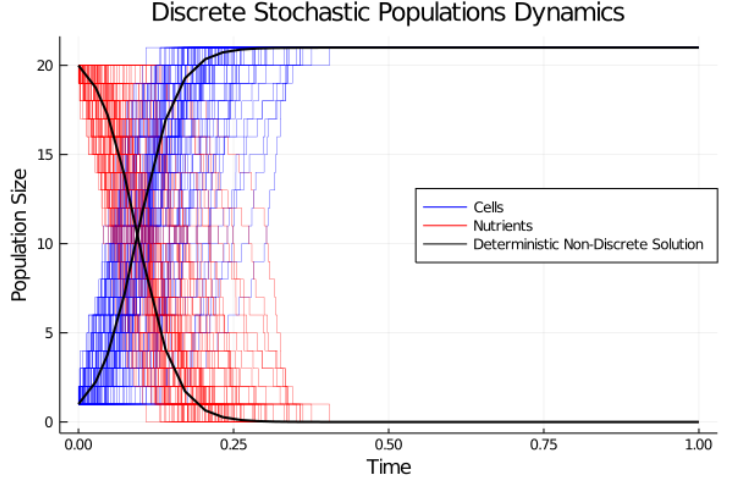
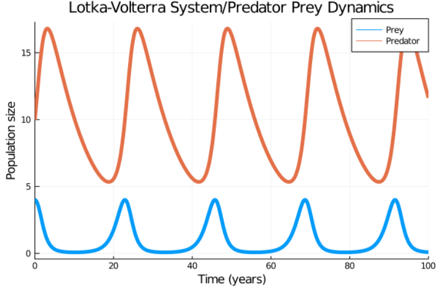
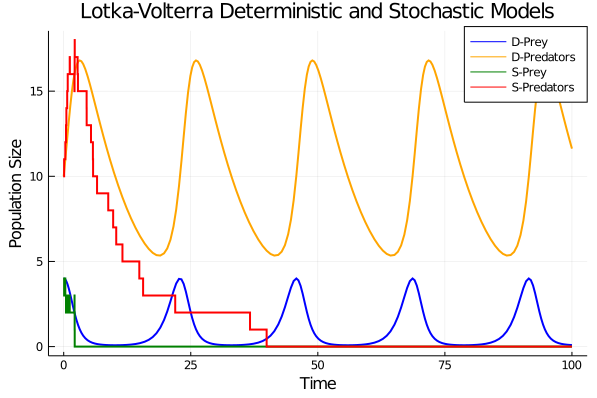

# Week Four

## Logistic Map: X<sub>n+3</sub> = X<sub>n</sub>

Following from the previous week, I took one step further and solved X<sub>n+3</sub> = X<sub>n</sub>

Using wolfram Alpha once again, the roots of the equation X<sub>n+3</sub> = X<sub>n</sub> for Xn can be found to be:


By inputting just one of the above solutions into the `vary` function for the values of X and running for 10 iterations, a stable set of identical images will be produced:

```julia
r = 4
x = (1/2)*(1-sqrt(-(2sqrt(r-4))/r^(3/2)-2/r+1))
vary("xn+3";x0_vals=(x),r_vals=r, nvals=1:50)
```


When the code is run again, but this time by adding ε epsilon onto the value of x seen below, it quickly destabilises the system and causes chaotic behaviour typically seen in the logistic map to occur once again:

```julia
r = 4
ε = 0.00001
x = (1/2)*(1-sqrt(-(2sqrt(r-4))/r^(3/2) - 2/r + 1))
vary("xn+3";x0_vals=(x+ε),r_vals=r, nvals=1:50)
```


## Discrete Stochastic Modelling of Cell Population Dynamics

### Logistic Graph

Up until now I have been simulating from deterministic continuous models such as the logistic map system, the exponential and logistic models and the Lotka-Volterra system, as well as the Lorenz attractor system.

This week however, I began modelling discrete stochastic systems with the help of the [DiffEqBiological.jl](https://diffeq.sciml.ai/release-6.6/index.html) package, as well as the previously used [DifferentialEquations.jl](https://diffeq.sciml.ai/stable/) package and the [Plots.jl](https://docs.juliaplots.org/latest/) package.

I began by writing the logistic model as a biochemical reaction network. Unlike the previous model I made for the logistic graph, this model describes a population of cells consuming a limited 'population' of "nutrients". The purpose of this model is to show the population dynamics as a cell undergoes reproduction/division.

I defined reaction network called `logistic_model` which was written as so:

```julia
logistic_model = @reaction_network logistic begin
  r, cell + nutrient --> 2cell
end r
```

As you can see, it is a very basic description of cell division, with no other parameters other than the rate of reproduction `r`. As seen above, one cell unit and one nutrient unit will "react" to form two cells, 'using up' the nutrient in the process.

I then defined the initial conditions and values for `r`:

```julia
r = 1.5
cell0 = 1.0
nutrient0 = 20.0

tspan = (0.0,1.0)
p =  (r)
u0 = [cell0, nutrient0]
```

I then ran the code to plot the graph, which will show a symmetrical pattern, with cell reproduction increasing at the same rate as the nutrients are 'used up'.

```julia
oprob = ODEProblem(logistic_model, u0, tspan, p)
osol = solve(oprob)
Kbio = nutrient0+cell0
n = [((Kbio)*(cell0*exp(r*t)))/((Kbio)+(cell0*(exp(r*t)-1))) for t in osol.t]
plot(osol.t, [osol.u[i][1] for i in 1:length(osol.t)], labels="Cells", color= "blue", lw=2.0)
plot!(osol.t, [osol.u[i][2] for i in 1:length(osol.t)], labels="Nutrients", color="red", title="Logistic Graph with Nutrient Limiting Factor", xaxis="Time", yaxis="Population Size", lw=2.0, legend=:right)
```
The combined code above produces this graph:


The next step was to overlay the discrete stochastic solution on top of this graph to show the differences between the two.

```julia
prob = DiscreteProblem(u0, tspan ,p)
jump_prob = JumpProblem(prob,Direct(),logistic_model)
sol = solve(jump_prob,FunctionMap())
plot!(sol.t, [sol.u[i][1] for i in 1:length(sol.t)], labels="", color="purple", lw=2)
plot!(sol.t, [sol.u[i][2] for i in 1:length(sol.t)], labels="", color="crimson", lw=2)
```

When overlaid on the deterministic graph it looks like this:


As you can clearly see, the thicker lines which show the stochastic solution seem to step up in increments, unlike the thin lined deterministic solution which shows a smooth curve. This is because the stochastic solution is also *discrete* meaning that the values it contains must be integers (whole numbers). This makes more sense when you think about a population of any animal or cell. You cannot have half or 0.7 of a cell or human.

The next thing I did was to run the discrete stochastic model multiple times and plot them all on the same graph. Because of the stochastic (random, uncertain) nature of the system and as you shall see, the results will not be the same. They do however show a common trend. This trend  can be seen clearly when the graph is plotted multiple times. I used the following code to do this:

```julia
nsins=100  # this is the number of times the stochastic graph will be plotted
prob = DiscreteProblem(u0, tspan ,p)
jump_prob = JumpProblem(prob,Direct(),logistic_model)
solutions =[solve(jump_prob,FunctionMap()) for i in 1:nsins]
plot(solutions[1].t, [solutions[1].u[i][1] for i in 1:length(solutions[1].t)], labels="Cells", color= "blue", xaxis="Time", yaxis="Population Size", title="Discrete Stochastic Populations Dynamics", lw=0.3)
plot!(solutions[1].t,[solutions[1].u[i][2] for i in 1:length(solutions[1].t)], labels="Nutrients", color="red", lw=0.3)
for j in 2:nsins
    p=plot!(solutions[j].t, [solutions[j].u[i][1] for i in 1:length(solutions[j].t)], labels="", color= "blue", lw=0.3)
    q=plot!(solutions[j].t,[solutions[j].u[i][2] for i in 1:length(solutions[j].t)], labels="", color="red", lw=0.3)
    display(p)
    display(q)
end
oprob = ODEProblem(logistic_model, u0, tspan, p)
osol = solve(oprob)
Kbio = nutrient0+cell0
n = [((Kbio)*(cell0*exp(r*t)))/((Kbio)+(cell0*(exp(r*t)-1))) for t in osol.t]
plot!(osol.t, [osol.u[i][1] for i in 1:length(osol.t)], labels="Deterministic Continuous Solution", color="black", lw=2)
plot!(osol.t, [osol.u[i][2] for i in 1:length(osol.t)], labels="", color="black", legend=:right, lw=2)
```
This will then output the following plot:



As you can see the most highest concentration of red and blue lines (the discrete stochastic plots) appear around the deterministic continuous solution line. You can also observe that some red and blue lines appear much further out to the right than the black line. This is a perfect example of the stochastic nature of the model. It also shows the lower likelihood that plots will be drawn away from the deterministic solution as only very few plots have been drawn far away from the curve.

### Exponential Model

The next model I created was one that I had also previous made in a different format, the exponential model. This model is a bit more simple that the logistic model. It wrote it like this:

```julia
exponential_model = @reaction_network exponential begin
  r, cell  --> 2cell
end r
```

As you can see unlike the logistic model there is no limiting factor like nutrients or oxygen as discussed in last week's report. Just like the logistic model though, `r` is the rate of growth for this model.
I then defined the initial conditions rate of growth and then plotted the deterministic graph and discrete stochastic solutions on top of each other just as I did with the logistic model:

```julia
r = 2.0
cell0 = 1.0

tspan = (0.0,1.0)
p = (r)
u0 = [cell0]

oprobe = ODEProblem(exponential_model, u0, tspan, p)
osole = solve(oprobe)
plot(osole, labels="Deterministic Solution", lw=2)

prob = DiscreteProblem(u0, tspan ,p)
jump_prob = JumpProblem(prob,Direct(),exponential_model)
sole = solve(jump_prob,FunctionMap())
plot!(sole, title="Deterministic and Stochastic Exponential Model", xaxis="Time", yaxis="Popuplation Size", legend=:left, lw=2, labels="Stochastic Solution")
```


As you can see, just as with the discrete logistic model, this discrete stochastic solution of the exponential model is jagged and step like as we would expect. If I was to plot this graph again, it would plot the same blue line but a different, potentially drastically different, orange line. This again is due the deterministic and stochastic nature of each solution of the model.

### Lotka-Volterra Model

Another model which I plotted with the discrete stochastic solution was the Lotka-Volterra predator/prey model, which was also modelled and discussed in a previous weekly report. Here is a reminder of what the deterministic solution for the model looks like:



This model was more complicated to write code for as it involved three separate interacting or reactions and three separate parameters. I defined the model like so:

```julia
lv_model = @reaction_network lv begin
  k1, prey --> 2prey  # This reaction is the reproduction reaction for the prey
  k2, prey + predator --> 2predator # This reaction is the reproduction reaction for the predators, which "uses up a prey for each iteration"
  k3, predator --> null # This is the "natural death" reaction for the predators
end k1 k2 k3 # as also previously discussed, k1,2 and 3 are the parameters for this model
```

I then defined the initial conditions and parameter values as I have done with all previous models and then plotted the discrete stochastic solution on top of the deterministic solution.

```julia
k1 = 1.0
k2 = 0.1
k3 = 0.1

prey0 = 4.0
predator0 = 10.0
null0 = 0.0
tspan = (0.0,100.0)
p =  (k1,k2,k3)
u0 = [prey0, predator0]

oproblv = ODEProblem(lv_model, u0, tspan, p)
osollv = solve(oproblv)
plot(osollv.t, [osollv.u[i][1] for i in 1:length(osollv.t)], labels="D-Prey", color= "blue", lw=2)
plot!(osollv.t, [osollv.u[i][2] for i in 1:length(osollv.t)], labels="D-Predators", color="orange", lw=2)

prob = DiscreteProblem(u0, tspan ,p)
jump_prob = JumpProblem(prob,Direct(),lv_model)
sollv = solve(jump_prob,FunctionMap())
plot!(sollv.t, [sollv.u[i][1] for i in 1:length(sollv.t)], labels="S-Prey", color= "green", lw=2.0)
plot!(sollv.t, [sollv.u[i][2] for i in 1:length(sollv.t)], labels="S-Predators", color="red", lw=2.0, title="Lotka-Volterra Deterministic and Stochastic Models", xaxis="Time", yaxis="Population Size")
```



In the above graph, D-prey and D-predators represent the lines drawn by the deterministic solution and S-prey and S-predators represent the lines drawn the discrete stochastic solution. As you can see both prey and predators in the stochastic solution go extinct before half way through the graph. This is because of the discrete nature of the model. In the stochastic model, once the predators consume all of the prey, the population of prey will be `0`and therefore won't reproduce, irrespective of how high the rate of reproduction is as `X*0=0`. Consequently this will also mean that the predators will have no food to eat and will eventually starve and go extinct. Both of these inevitable occurrences are shown in the graph above. In the deterministic model however, the values of predator and prey can be non-integer values and therefore as can be seen, once the population of predators has fallen sufficiently the prey population can once again repopulate and the process will repeat itself.

Distinct similarities between the deterministic continuous and discrete stochastic solutions can be seen however, when greater initial conditions or initial population sizes are used. This can be seen in this example:


In this plot you can clearly see the deterministic and stochastic lines of the predators (yellow and red lines) overlapping and showing essentially the exact same trend until around `t=25`. Compared to the previous example, where initial population sizes of 4 and 10 were used, in this example much larger initial conditions are used and as a result, the similarities between both solutions becomes much clearer. Still however, the stochastic solution lacks the continuous nature of the deterministic solution and so eventually, and inevitably both of it's populations will become extinct.

## Mitochondria, mtDNA and Clonal Expansion

As part of my research for my project I read Max Piotrowicz's [blog post](http://mito.ncl.ac.uk/clonexp/clonal_expansion/) about clonal expansion. I also read [Lawless et al.(2020)](https://royalsocietypublishing.org/doi/10.1098/rsob.200061). Here is a summary of my notes and understanding of [mitochondria](https://www.genome.gov/genetics-glossary/Mitochondria#:~:text=Mitochondria%20are%20membrane%2Dbound%20cell,called%20adenosine%20triphosphate%20(ATP))., [mtDNA](https://en.wikipedia.org/wiki/Mitochondrial_DNA#:~:text=Mitochondrial%20DNA%20(mtDNA%20or%20mDNA,%2C%20adenosine%20triphosphate%20(ATP))) (mitochondrial DNA) and the process of clonal expansion.

### Mitochondria

Inside of each cell there are smaller structures which each carry out their own functions. These microscopic structures are called [organelles](https://en.wikipedia.org/wiki/Organelle) and one type of these organelles are known as mitochondria. The function of these is to produce energy required by the cell to perform it's normal functions. They do so by converting sugars, proteins and fats into adenosine triphosphate (ATP). They also take part in an important process known as [apoptosis](https://en.wikipedia.org/wiki/Apoptosis) or cell death. Because over 90% of the energy needed by cells is produced by mitochondria, any improper functions of mitochondria can cause detrimental effects to patients who suffer from mitochondrial diseases. Adults who suffer from mitochondrial diseases can experience muscle weakness, intolerance to exercise and fatigue. [Drooping eyelids](https://www.umdf.org/types/cpeo-kss/#:~:text=at%20the%20NIH%20%3E%3E-,Kearns%2DSayre%20Syndrome,seeing%20in%20dimly%20lit%20environments.) is also a typical symptom of mitochondrial diseases.

 [](https://bionewscentral.com/big-changes-from-small-players-mitochondria-alter-body-metabolism-and-gene-expression/)

### mtDNA

mtDNA or mitochondrial DNA is found in mitochondria and are distinct from [nuclear DNA](https://en.wikipedia.org/wiki/Nuclear_DNA#:~:text=Nuclear%20DNA%20(nDNA)%2C%20or,DNA%20coding%20for%20the%20rest.) in many ways. Where nuclear DNA contains many billion base pairs, mtDNA contains only 16,569. Where nuclear DNA is linear in shape mtDNA is circular and much smaller than nuclear DNA. There are two types of mtDNA, "wild type" and "mutated" mtDNA. Wild type are widespread and are 'normal' and mutated mtDNA occurs when point mutation or deletion happens within the mtDNA. Point mutations occur when one base pair mutates. If this particular pair is important for the mitochondria to function properly then it could have serious consequences further on in the patients life. Deletions occur when a whole section of the mtDNA circle is removed, with the two ends joining back together after.

[](https://www.researchgate.net/figure/Human-mitochondrial-DNA-mtDNA-The-mtDNA-consists-of-a-light-inner-and-heavy_fig1_329446024)

### Clonal Expansion

Clonal expansion is the process in which the amount of mutated mtDNA within individual cells increases, usually of the decades of a patient's lifetime. This process can be considered to be a discrete stochastic process. One of the main reasons why mathematical modelling is so important in the continued study and research into clonal expansion is because of the huge amount of time in which the process takes place. It would be extremely time consuming and expensive to conduct real life observations in a single patient, however it is much more practical and cheaper to simulate the process of clonal expansion on a computer using a mathematical model.

[](https://royalsocietypublishing.org/doi/10.1098/rsob.200061)
