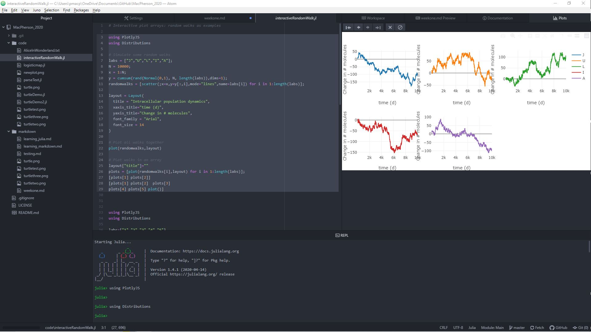

# Week One
## Monday
Monday was the first day of my research project. The aim of the project is to use [mathematical modelling](https://people.maths.bris.ac.uk/~madjl/course_text.pdf) to simulate [mitochondrial DNA](https://ghr.nlm.nih.gov/mitochondrial-dna) population dynamics in the [Julia programming language](https://julialang.org/).

First of all I was introduced to GitHub, a software sharing and development website, which I will be using throughout the project to share and store code and useful research materials. Link to my GitHub page [here](https://github.com/lwlss/MacPherson_2020).


I was also introduced to [Atom](https://atom.io/), an extremely useful text editor in which I can write, test, store and compare code. I use the [Juno](http://docs.junolab.org/stable/) package for Atom so I can use and run Julia code in Atom. I also learned how to write with markdown, which I can use to write text and comments onto the GitHub repository, including this document which I wrote with markdown. I also used [this](https://guides.github.com/features/mastering-markdown/) guide to help.

This is an example of what working in Atom looks like:



## Tuesday
On Tuesday I began properly learning Julia. I learned how to set variables, create arrays which are groups of variables and manipulate these arrays with various methods. I also learned about dictionaries, which can be used to group objects and numbers and assign information to them, and iterative loops which can perform multiple tasks in a row without having to manually type out commands for each task. Finally I learned about functions which can repeat an argument with different inputs.

###### Variables

```julia
variable = 20
Scotland = "The Best"
a = 10/2
b = 8

a*b # (a multiplied by b)
= 40.0
```

###### Arrays

```julia
array = [1,2,3,4,5]
NiceFood = ["samosas", "noodles and pesto", "tiramisu", "ice cream"]

# You can also filter certain words or letters out of long arrays.
sentence = "This is a long sentence with lots of words and letters in it."
sentence = split(sentence,"")
filter!(e->e!="i", sentence)
join(sentence,"")
="Ths s a long sentence wth lots of words and letters n t."
```

###### Dictionaries

```julia
testresults = Dict()
testresults["Amy"]=67
testresults["John"]=48
testresults["Peter"]=85
testresults["Claire"]=59

print(testresults["John"])
```
###### Iterative Loops

```julia
n=20
for i in 1:n
  println(i)
end
```
###### Functions
```julia
function tell(x,y)
  if x<y println("left is smaller than right")
   elseif x==y println("left is equal to right")
   else println("left is bigger than right")
  end
end
```

I was also given some coding tasks to do in my own time. I was given a copy of a book, code to spilt it into an array and tasks, one of which was "write a function to tell how many times a word appeared".

```julia
function wordcount(x)
    count(i->(lowercase(i)==x),farr)
end
```
The array 'farr' was made by turning the document with the novel 'Alice in Wonderland' into a string (a line of text), splitting the string into an array with each individual word being an individual part of the array e.g:

```julia
array = ["this", "is", "an", "example"]
```
The function then can identify how many times a word appears in the novel. I could also figure out how many words are in the novel by using the command:

```julia
length(farr)
= 26466

wordcount("after")
= 40

wordcount("and")
= 766
```


## Wednesday

On Wednesday I was given a presentation on the some of the many uses and benefits of the Julia programming language. One of the main advantages and unique aspects of Julia is its easy to learn syntax and its fast speed which makes it an ideal scientific programming language as when working with huge sets of data it is useful to have quick processing speeds. Compared with python which has an easy syntax but slower processing speed or C++ which has a fairly complex syntax but fast processing speed, Julia is clearly the best to use for scientific programming and was in fact designed exactly for this purpose.

I also learned some of the uses of Julia in a scientific context such as analysing images of cells or to simulate mutations in mtDNA and then graph the results, which is a big part of my project as well.

## Thursday

### Logistic map

On Thursday I was given the task to create a function which would act as a [logistic map](https://en.wikipedia.org/wiki/Logistic_map) with formula `xn+1=r*xn*(1-xn)` which I could enter different values for `xn` & `r`.


To begin with I came up with a function which would carry out the equation once;
```julia
function logistic(r,xn)
    r*xn*(1.0-xn)
end
```
Then with some help I turned this into a function which would carry it out to any iteration of `n` that I could set it to;
```julia
function logisticmap(x0,r=4,n=10)
    results = [(x0,logistic(r,x0))];
    N = 100;
    for i in 1:(N-1)
      xold = results[end][2]
      xnew = logistic(r,xold)
      append!(results,[(xold,xnew)])
      print(results)
  end
end
```

My next task/aim is to map the outputs from this function on a graph to see how changing the inputs of x, r or n could affect the output.  


### Graphics in Julia
I also installed the [Luxor package](http://juliagraphics.github.io/Luxor.jl/v0.8.3/index.html) with which you can code graphics on Julia such as nice patterns, shapes and graphs. I was given a [piece of code](https://github.com/lwlss/MacPherson_2020/blob/master/code/turtleDemo.jl) which when executed would draw this picture:


I changed some values of the code, including pen width, turn angle and background colour to make the following two images:


I also tried to make a function which for different input values would draw a different image each time:
```julia
function draw(w,t)
 Drawing(6000,4000,"turtlethree.png")
 origin()
 background("midnightblue")
 turtle = Turtle()
 Pencolor(turtle, "blue")
 Penwidth(turtle, w)
 n=5
 for i in 1:8000
  Forward(turtle, n)
  Turn(turtle, t)
  HueShift(turtle)
  n += 0.85
end
fontsize(20)
finish()
end
```

## Friday

On Friday I spend some time trying to sort some issues with the code above and spend the rest of the day writing this report.
